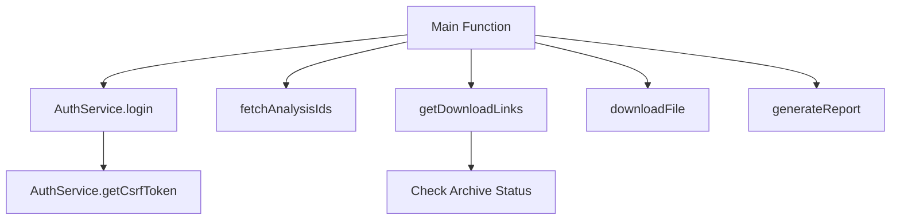
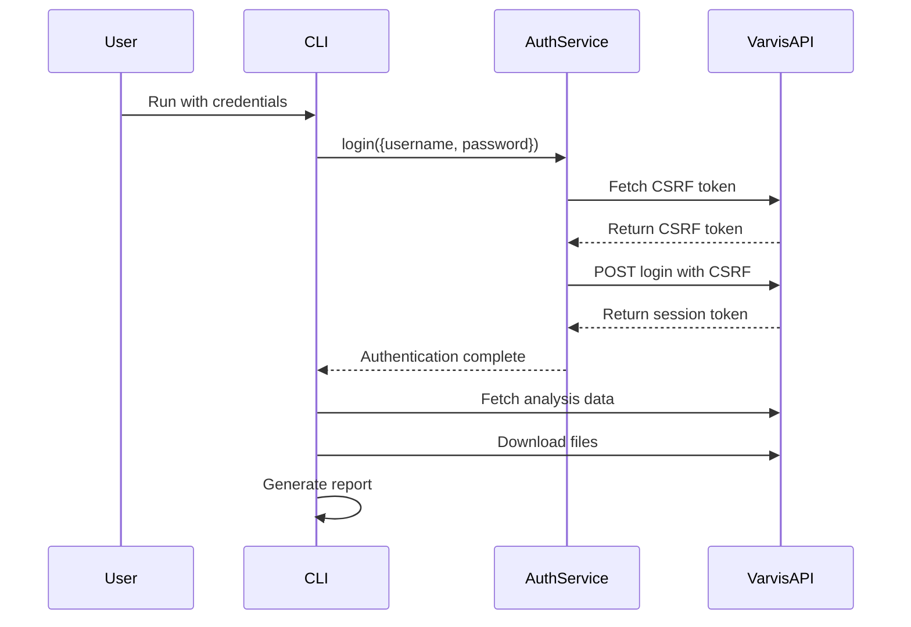

# Varvis Download CLI

A command-line interface (CLI) tool for downloading BAM, BAI, and VCF files from the Varvis API. Built for bioinformatics workflows, it supports authentication, file filtering, proxy configuration, and archived file restoration.

## Table of Contents

- [Installation](#installation)
- [Quick Start](#quick-start)
- [Usage & Parameters](#usage--parameters)
- [Authentication](#authentication)
- [Archive Management](#archive-management)
- [Advanced Features](#advanced-features)
- [Development](#development)
- [API Reference](#api-reference)

## Installation

### Prerequisites

- [Node.js](https://nodejs.org/) v20.16.0 or higher
- NPM or Yarn for package management
- **External Tools** (for range-based downloads):
  - `samtools` v1.17+
  - `tabix` v1.20+
  - `bgzip` v1.20+

### Setup

```bash
git clone https://github.com/LaborBerlin/varvis-download.git
cd varvis-download
npm install
chmod +x varvis-download.js
npm link  # Optional: makes the tool globally accessible
```

## Quick Start

### Basic Download

```bash
# Download all BAM/BAI files for specific analysis IDs
./varvis-download.js -u <username> -p <password> -t <target> -a <analysisId1,analysisId2>

# Using environment variables (recommended for security)
export VARVIS_USER="your_username"
export VARVIS_PASSWORD="your_password"
./varvis-download.js -t laborberlin -a 12345,67890
```

### List Available Files

```bash
# List files without downloading
./varvis-download.js -u <username> -p <password> -t <target> -a <analysisId> --list
```

## Usage & Parameters

### Required Parameters

| Parameter  | Short | Description | Example                      |
| ---------- | ----- | ----------- | ---------------------------- |
| `--target` | `-t`  | API target  | `laborberlin`, `uni-leipzig` |

**At least one of the following is required:**

- `--analysisIds` (`-a`): Analysis IDs (comma-separated)
- `--sampleIds` (`-s`): Sample IDs to filter analyses (comma-separated)
- `--limsIds` (`-l`): LIMS IDs to filter analyses (comma-separated)

### Authentication Options

| Parameter    | Short | Description                | Note                              |
| ------------ | ----- | -------------------------- | --------------------------------- |
| `--username` | `-u`  | Varvis API username        | Can use `VARVIS_USER` env var     |
| `--password` | `-p`  | Varvis API password        | Can use `VARVIS_PASSWORD` env var |
| `--config`   | `-c`  | Path to configuration file | Default: `.config.json`           |

### File & Output Options

| Parameter       | Short | Default       | Description                              |
| --------------- | ----- | ------------- | ---------------------------------------- |
| `--destination` | `-d`  | `.`           | Download destination folder              |
| `--filetypes`   | `-f`  | `bam,bam.bai` | File types to download (comma-separated) |
| `--overwrite`   | `-o`  | `false`       | Overwrite existing files                 |
| `--list`        | `-L`  | `false`       | List available files without downloading |

### Filtering & Range Options

| Parameter  | Short | Description           | Example              |
| ---------- | ----- | --------------------- | -------------------- |
| `--filter` | `-F`  | Filter expressions    | `"analysisType=SNV"` |
| `--range`  | `-g`  | Genomic range         | `"chr1:1-100000"`    |
| `--bed`    | `-b`  | BED file with regions | `regions.bed`        |

### Archive Management

| Parameter                   | Short  | Default                     | Description                               |
| --------------------------- | ------ | --------------------------- | ----------------------------------------- |
| `--restoreArchived`         | `-ra`  | `ask`                       | Archive mode: `ask`, `all`, `force`, `no` |
| `--restorationFile`         | `-rf`  | `awaiting-restoration.json` | Restoration JSON file                     |
| `--resumeArchivedDownloads` | `-rad` | `false`                     | Resume archived downloads                 |

### Logging & Reports

| Parameter      | Short  | Default | Description                                 |
| -------------- | ------ | ------- | ------------------------------------------- |
| `--loglevel`   | `--ll` | `info`  | Log level: `debug`, `info`, `warn`, `error` |
| `--logfile`    | `--lf` | -       | Path to log file                            |
| `--reportfile` | `-r`   | -       | Path to download report                     |

### Proxy Configuration

| Parameter         | Short   | Description    |
| ----------------- | ------- | -------------- |
| `--proxy`         | `-x`    | Proxy URL      |
| `--proxyUsername` | `--pxu` | Proxy username |
| `--proxyPassword` | `--pxp` | Proxy password |

### Other Options

| Parameter   | Short | Description              |
| ----------- | ----- | ------------------------ |
| `--version` | `-v`  | Show version information |
| `--help`    | `-h`  | Show help message        |

## Authentication

### Environment Variables (Recommended)

```bash
export VARVIS_USER="your_username"
export VARVIS_PASSWORD="your_password"
./varvis-download.js -t laborberlin -a 12345
```

### Configuration File

Create `.config.json`:

```json
{
  "username": "your_username",
  "target": "laborberlin",
  "destination": "./downloads",
  "loglevel": "info"
}
```

### Interactive Password Prompt

If no password is provided via environment variables or CLI arguments, the tool will prompt for it securely with hidden input.

## Archive Management

### Archive Restoration Modes

| Mode            | Behavior                                 |
| --------------- | ---------------------------------------- |
| `ask` (default) | Prompt for each archived file            |
| `all`           | Ask once, apply to all archived files    |
| `force`         | Automatically restore all archived files |
| `no`            | Skip archived files entirely             |

```bash
# Examples
./varvis-download.js -t laborberlin -a 12345 --restoreArchived force
./varvis-download.js -t laborberlin -a 12345 --restoreArchived no
```

### Resume Archived Downloads

```bash
# Trigger restoration and save to custom file
./varvis-download.js -t laborberlin -a 12345 --restoreArchived force --restorationFile my-restorations.json

# Later, resume downloads when files are ready
./varvis-download.js --resumeArchivedDownloads --restorationFile my-restorations.json
```

## Advanced Features

### Filtering Examples

```bash
# Filter by analysis type
./varvis-download.js -t laborberlin -a 12345 -F "analysisType=SNV"

# Multiple filters
./varvis-download.js -t laborberlin -s LB24-001 -F "analysisType=SNV" "sampleId>LB24-0001"
```

### Range Downloads

```bash
# Single genomic range
./varvis-download.js -t laborberlin -a 12345 -g "chr1:1-100000"

# Multiple ranges (space-separated)
./varvis-download.js -t laborberlin -a 12345 -g "chr1:1-100000 chr2:1-100000"

# BED file with complex regions
./varvis-download.js -t laborberlin -a 12345 -b complex-regions.bed
```

### Batch Operations

```bash
# Download multiple file types with custom settings
./varvis-download.js -t laborberlin \
  -a "12345,67890,11111" \
  -f "bam,bam.bai,vcf.gz,vcf.gz.tbi" \
  -d "./batch-download" \
  --overwrite \
  --restoreArchived all
```

### Proxy Usage

```bash
# Basic proxy
./varvis-download.js -t laborberlin -a 12345 -x "http://proxy.example.com:8080"

# Proxy with authentication
./varvis-download.js -t laborberlin -a 12345 -x "http://proxy.example.com:8080" --pxu proxy_user --pxp proxy_pass
```

## Development

### Testing

```bash
# Run all tests
npm test

# Run tests with coverage
npm test -- --coverage
```

### Code Quality & Formatting

```bash
# Format code with Prettier
npm run format

# Run ESLint for code quality checks
npm run lint

# Auto-fix ESLint issues where possible
npm run lint:fix
```

### Version Management

```bash
# Semantic versioning
npm version patch   # 0.17.1 -> 0.17.2
npm version minor   # 0.17.1 -> 0.18.0
npm version major   # 0.17.1 -> 1.0.0
```

## API Reference

### Architecture Overview



### Authentication Flow



### Core Functions

#### `AuthService.login(user, target)`

Authenticates with Varvis API using CSRF tokens.

**Parameters:**

- `user`: Object with username and password
- `target`: Varvis API target (e.g., "laborberlin")

**Returns:** Promise resolving to session token

#### `fetchAnalysisIds(target, token, agent, sampleIds, limsIds, filters, logger)`

Retrieves analysis IDs based on filtering criteria.

#### `getDownloadLinks(analysisId, filter, target, token, agent, logger, restoreArchived, rl)`

Fetches download links for files, handling archived file restoration.

#### `downloadFile(url, outputPath, overwrite, agent, rl, logger, metrics)`

Downloads a file with progress tracking and metrics collection.

---

## Contributing

Contributions are welcome! Please:

1. Run `npm run lint:fix` to ensure code quality and formatting
2. Add tests for new functionality
3. Follow semantic versioning for API changes
4. Update documentation for new features

## License

GPL-3.0 - See LICENSE file for details.
