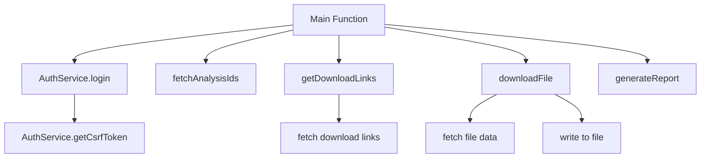
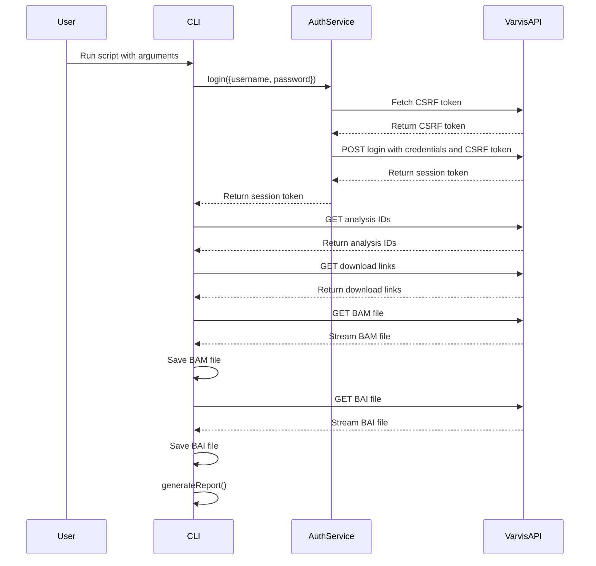

# Varvis Download CLI

This script provides a command-line interface (CLI) to download BAM and BAI files from the Varvis API. It supports authentication, fetching download links, downloading files, and proxy configuration.

## Installation

1. Ensure you have [Node.js](https://nodejs.org/) installed.
2. Clone the repository.
3. Install the required packages.
4. Make the script executable (Linux/Mac).
5. Link the script to make it globally accessible (optional).

```sh
git clone https://github.com/LaborBerlin/varvis-download.git
cd varvis-download
npm install
chmod +x varvis-download.js
npm link
```

## Program Requirements

- Node.js v20.16.0 or higher
- NPM or Yarn for package management

## Usage

```sh
./varvis-download.js --username <username> --password <password> --target <target> --analysisIds <analysisId> [options]
```

### Parameters

- `--config`, `-c`: Path to a configuration file (default: .config.json in the current directory)
- `--username`, `-u`: Varvis API username (required)
- `--password`, `-p`: Varvis API password (required)
- `--target`, `-t`: Target for the Varvis API (e.g., laborberlin or uni-leipzig) (required)
- `--analysisIds`, `-a`: Analysis ID(s) to download files for, comma-separated for multiple IDs (required)
- `--sampleIds`, `-s`: Sample IDs to filter analyses (comma-separated)
- `--limsIds`, `-l`: LIMS IDs to filter analyses (comma-separated)
- `--destination`, `-d`: Destination folder for the downloaded files (default: current directory)
- `--proxy`, `-x`: Proxy URL (optional)
- `--proxyUsername`, `-pxu`: Proxy username (optional)
- `--proxyPassword`, `-pxp`: Proxy password (optional)
- `--overwrite`, `-o`: Overwrite existing files (default: false)
- `--filetypes`, `-f`: File types to download (comma-separated, default: 'bam,bam.bai')
- `--loglevel`, `-ll`: Logging level (info, warn, error, debug, default: 'info')
- `--logfile`, `-lf`: Path to the log file (optional)
- `--reportfile`, `-r`: Path to the report file (optional)
- `--range`, `-g`: A genomic range for ranged download (e.g., 'chr1:1-100000'). Now supports multiple ranges separated by spaces (e.g., 'chr1:1-100000 chr2:1-100000') (optional)
- `--bed`, `-b`: A BED file containing genomic ranges for ranged download (optional)
- `--version`, `-v`: Show version information
- `--help`, `-h`: Show help message

## Configuration File

You can use a configuration file to specify default values for the parameters. The configuration file should be a JSON file with the following structure:

```json
{
  "username": "your_username",
  "password": "your_password",
  "target": "your_target",
  "destination": "download",
  "proxy": "http://your_proxy:8080",
  "proxyUsername": "proxy_user",
  "proxyPassword": "proxy_pass",
  "overwrite": false,
  "filetypes": "bam,bam.bai"
}
```

To use a configuration file, specify the --config or -c parameter followed by the path to the config file:

```sh
./varvis-download.js -a '12345,67890' -c ./your_config.json
```

## Example

```sh
./varvis-download.js -u your_username -p your_password -t laborberlin -a 12345 -d /path/to/save -x http://proxy.example.com:8080 -o
```

#### Single Genomic Range:

```sh
./varvis-download.js -u your_username -p your_password -t laborberlin -a 12345 -g chr1:1-100000 -d /path/to/save
```

#### Multiple Genomic Ranges:

```sh
./varvis-download.js -u your_username -p your_password -t laborberlin -a 12345 -g "chr1:1-100000 chr2:200000-300000" -d /path/to/save
```

#### Using a BED file:

```sh
./varvis-download.js -u your_username -p your_password -t laborberlin -a 12345 --bed /path/to/regions.bed -d /path/to/save
```

### Output File Naming

When using the `--range` or `--bed` options, the output filename is generated dynamically:

- **Single range**: The filename will include the genomic range (e.g., `sample.chr1_1_100000.bam`).
- **Multiple ranges**: The filename will include `"multiple-regions"` (e.g., `sample.multiple-regions.bam`).

## Diagrams

### Overview of the Functions



### Function Flow

#### Main Function



### Detailed Function Documentation

#### `AuthService` Class

Handles authentication with the Varvis API.

##### `async getCsrfToken()`

Fetches the CSRF token required for login.

- **Returns**: `Promise<string>` - The CSRF token.

##### `async login(user, target)`

Logs in to the Varvis API and retrieves the CSRF token.

- **Parameters**:
  - `user`: Object containing the username and password.
    - `username`: The Varvis API username.
    - `password`: The Varvis API password.
  - `target`: The Varvis API target.
- **Returns**: `Promise<Object>` - The login response containing the CSRF token.

#### `async confirmOverwrite(file, rl, logger)`

Prompts the user to confirm file overwrite if the file already exists.

- **Parameters**:
  - `file`: The file path.
  - `rl`: Readline interface for user input.
  - `logger`: Logger instance for logging.
- **Returns**: `Promise<boolean>` - True if the user confirms overwrite, otherwise false.

#### `async fetchWithRetry(url, options, retries = 3, logger)`

Retries a fetch operation with a specified number of attempts.

- **Parameters**:
  - `url`: The URL to fetch.
  - `options`: The fetch options.
  - `retries`: The number of retry attempts.
  - `logger`: Logger instance for logging.
- **Returns**: `Promise<Response>` - The fetch response.

#### `async fetchAnalysisIds(target, token, agent, sampleIds, limsIds, logger)`

Fetches analysis IDs based on sample IDs or LIMS IDs.

- **Parameters**:
  - `target`: The Varvis API target.
  - `token`: The CSRF token.
  - `agent`: The HTTP agent.
  - `sampleIds`: Array of sample IDs to filter analyses.
  - `limsIds`: Array of LIMS IDs to filter analyses.
  - `logger`: Logger instance for logging.
- **Returns**: `Promise<string[]>` - An array of analysis IDs.

#### `async getDownloadLinks(analysisId, filter, target, token, agent, logger)`

Fetches the download links for specified file types from the Varvis API for a given analysis ID.

- **Parameters**:
  - `analysisId`: The analysis ID to get download links for.
  - `filter`: An optional array of file types to filter by.
  - `target`: The Varvis API target.
  - `token`: The CSRF token.
  - `agent`: The HTTP agent.
  - `logger`: Logger instance for logging.
- **Returns**: `Promise<Object>` - An object containing the download links for the specified file types.

#### `async listAvailableFiles(analysisId, target, token, agent, logger)`

Lists available files for the specified analysis IDs.

- **Parameters**:
  - `analysisId`: The analysis ID to list files for.
  - `target`: The Varvis API target.
  - `token`: The CSRF token.
  - `agent`: The HTTP agent.
  - `logger`: Logger instance for logging.
- **Returns**: `Promise<void>`

#### `async downloadFile(url, outputPath, overwrite, agent, rl, logger, metrics)`

Downloads a file from the given URL to the specified output path.

- **Parameters**:
  - `url`: The URL of the file to download.
  - `outputPath`: The path where the file should be saved.
  - `overwrite`: Boolean to indicate whether to overwrite existing files.
  - `agent`: The HTTP agent.
  - `rl`: Readline interface for user input.
  - `logger`: Logger instance for logging.
  - `metrics`: Object to store download metrics.
- **Returns**: `Promise<void>`

#### `function generateReport(reportfile, logger)`

Generates a summary report of the download process.

- **Parameters**:
  - `reportfile`: Path to the report file.
  - `logger`: Logger instance for logging.
- **Returns**: `void`
