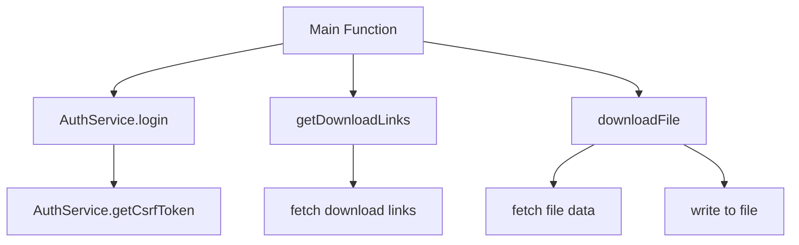
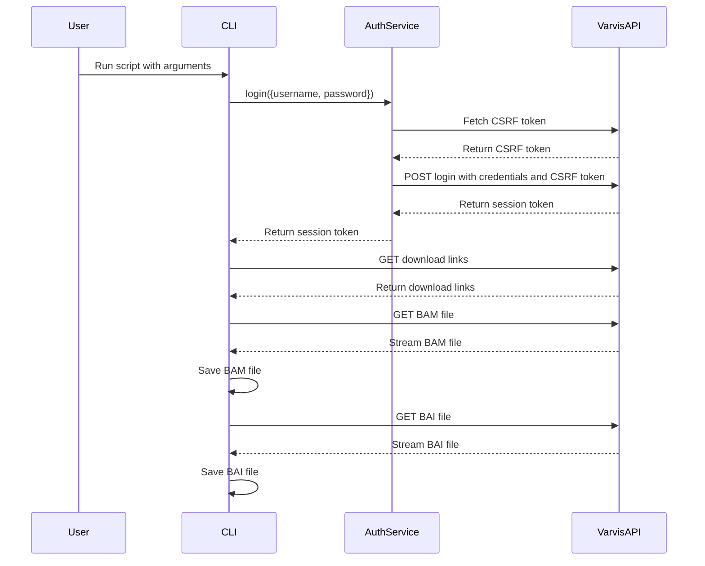

# Varvis Download CLI

This script provides a command-line interface (CLI) to download BAM and BAI files from the Varvis API. It supports authentication, fetching download links, downloading files, and proxy configuration.

## Installation

1. Ensure you have [Node.js](https://nodejs.org/) installed.
2. Clone the repository.
3. Install the required packages:

```sh
git clone https://github.com/berntpopp/varvis-download.git
cd varvis-download
npm install
npm link
```

## Program Requirements

- Node.js v20.16.0 or higher
- NPM or Yarn for package management

## Usage

```sh
./varvis-download.js --username <username> --password <password> --target <target> --analysisId <analysisId> [options]
```

### Parameters

- `--username`, `-u`: Varvis API username (required)
- `--password`, `-p`: Varvis API password (required)
- `--target`, `-t`: Target for the Varvis API (e.g., laborberlin or uni-leipzig) (required)
- `--analysisId`, `-a`: Analysis ID to download files for (required)
- `--destination`, `-d`: Destination folder for the downloaded files (default: current directory)
- `--proxy`, `-x`: Proxy URL (optional)
- `--overwrite`, `-o`: Overwrite existing files (default: false)
- `--version`, `-v`: Show version information
- `--help`, `-h`: Show help message

## Example

```sh
./varvis-download.js -u your_username -p your_password -t laborberlin -a 12345 -d /path/to/save -x http://proxy.example.com:8080 -o
```

## Diagrams

### Overview of the Functions



### Function Flow

#### Main Function



## Detailed Function Documentation

### `AuthService` Class

Handles authentication with the Varvis API.

#### `async getCsrfToken()`

Fetches the CSRF token required for login.

- **Returns**: `Promise<string>` - The CSRF token.

#### `async login(user)`

Logs in to the Varvis API and retrieves the CSRF token.

- **Parameters**:
  - `user`: Object containing the username and password.
    - `username`: The Varvis API username.
    - `password`: The Varvis API password.
- **Returns**: `Promise<Object>` - The login response containing the CSRF token.

### `async confirmOverwrite(file)`

Prompts the user to confirm file overwrite if the file already exists.

- **Parameters**:
  - `file`: The file path.
- **Returns**: `Promise<boolean>` - True if the user confirms overwrite, otherwise false.

### `async getDownloadLinks()`

Fetches the download links for BAM and BAI files from the Varvis API.

- **Returns**: `Promise<Object>` - An object containing the download links for BAM and BAI files.

### `async downloadFile(url, outputPath)`

Downloads a file from the given URL to the specified output path.

- **Parameters**:
  - `url`: The URL of the file to download.
  - `outputPath`: The path where the file should be saved.
- **Returns**: `Promise<void>`

### `async main()`

Main function to orchestrate the login and download process.

- **Returns**: `Promise<void>`
